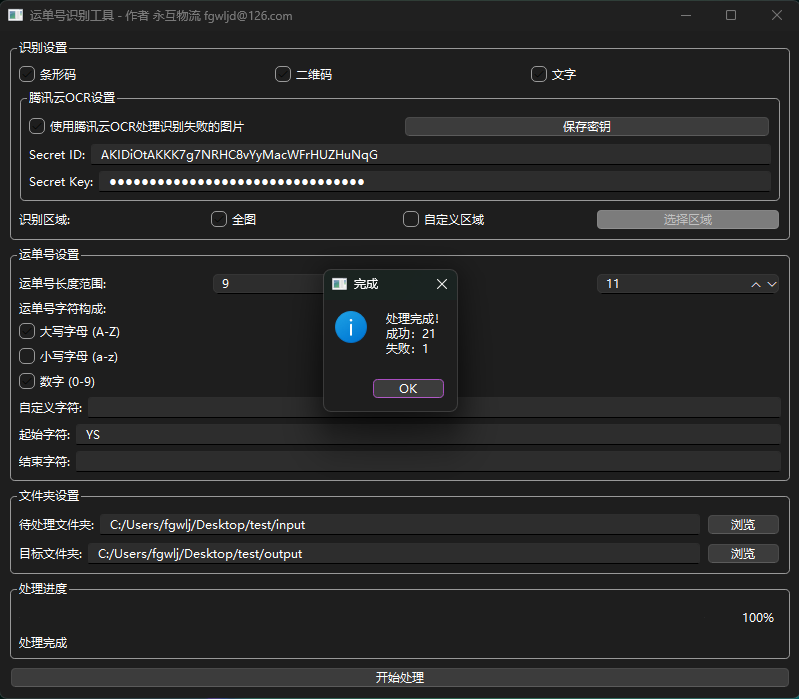

# 回单整理器

一个用于识别运单号并自动重命名运单图片的工具。

## 功能特点

<em>运单号智能识别与重命名工具主界面</em>

## 版本历史

### v1.3
- 新增腾讯云OCR支持，大幅提高识别率
- 新增中文路径和文件名支持
- 新增相同运单号多张图片支持
- 优化用户界面和操作体验

### v1.2
- 基础版本功能

## 使用说明

### 2. 高度定制化的运单号设置

<em>灵活的运单号规则配置</em>

## 开发环境

- Python 3.11
- PyQt6
- OpenCV
- Tesseract OCR
- pyzbar
- 腾讯云SDK

### 1. 启动软件

<em>软件启动界面</em>

### 2. 配置识别参数

<em>识别参数配置界面</em>

### 3. 设置文件路径

<em>文件路径配置界面</em>

### 4. 开始处理

<table>
  <tr>
    <td></td>
    <td></td>
  </tr>
  <tr>
    <td align="center"><em>批量处理进行中</em></td>
    <td align="center"><em>处理完成界面</em></td>
  </tr>
</table>

### 5. 查看处理结果

<em>处理结果统计界面</em>

## 🔧 常见问题解决

### 文字运单号识别准确率有待提高，处理速度有待多线程和GPU加速

<table>
  <tr>
    <td></td>
    <td></td>
  </tr>
  <tr>

  </tr>
</table>

## 联系方式

Email: fgwljd@126.com

Copyright © 2024 专注物流效率提升工具开发. All rights reserved.

版权所有 © 2024 永互物流
